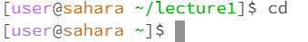

# These are my examples of using cd,ls and cat without arguments:  

## For cat:

>  

The terminal froze. 

## For ls:  

>

This showed the files in the current directory.

## For cd:  

>

This made the directory go down to the previous one.  

# These are my examples using cat,ls and cd with a path to a directory as an argument:  

## For cat:

>

This showed that cat does not work with directory as argument

## For ls:

>

This showed that ls does not move you to the directory but shows you what is inside that directory

## For cd:

>

This showed that cd directs you to the directory if you use the directory as argument

# This 
