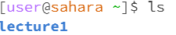

# These are my examples of using cd,ls and cat without arguments:  

## For cat:

>  

The terminal froze. 

## For ls:  

>

This showed the files in the current directory.

## For cd:  

>

This made the directory go down to the previous one.  

# These are my examples using cat,ls and cd with a path to a directory as an argument:  

## For cat:

>
